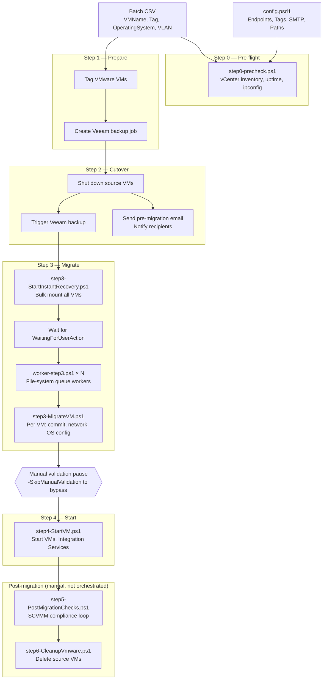
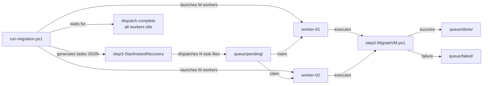

# VMware to Hyper-V migration scripts

This repository contains PowerShell 7 scripts to orchestrate a **VMware → Hyper-V** migration workflow with Veeam backups and SCVMM operations.

All migration scripts are in the `powershell-migration/` folder, with the main entry point:

- `powershell-migration/run-migration.ps1`
- `powershell-migration/step3-MigrateVM.ps1` also maps a source `OperatingSystem` value to the matching SCVMM operating system when the batch CSV or CMDB extract provides it.

## Project workflow

The migration is split into 4 steps:

1. **step1**: tag VMware resources and create the Veeam backup job.
2. **step2**: stop source VMs, trigger backup, and send pre-migration email.
3. **step3**: perform VM migration to Hyper-V in two phases:
   - **phase 1** — `step3-StartInstantRecovery.ps1` starts the Veeam Instant Recovery of **all** VMs in bulk (asynchronous `-RunAsync` starts when supported) and follows every mount session from a single console until each reaches `WaitingForUserAction`;
   - **phase 2** — persistent workers run the Instant Recovery commit and the SCVMM network/OS/post-configuration in parallel per VM.
4. **step4**: start the migrated VMs and verify Integration Services (`step4-StartVM.ps1`).

step2 flows straight into step3 with no pause. A manual validation pause happens **between step3 and step4** instead — once the migration is done, the script waits for confirmation (time to check the migrated VMs in SCVMM/Hyper-V) before launching step4 itself. `-SkipManualValidation` (or `-NonInteractive`) skips the pause without skipping step4.

The orchestrator can start from any step (`step1` through `step4`) to resume after interruption.
If `step3` already restored the VM but failed during SCVMM network/OS/post-configuration, you can replay only that tail of `step3` with `-ForceNetworkConfigOnly`.

Run `run-migration.ps1` with no arguments at all for an interactive walkthrough: it completes `config.local.psd1` if needed (see [Configuration](#configuration)) then prompts for `-Tag` and the other run options.

### Workflow diagram



### Architecture: step3 worker pool



## Prerequisites

- PowerShell 7+
- Access to:
  - VMware vCenter
  - Veeam Backup & Replication
  - SCVMM / Hyper-V environment
- Required PowerShell modules available on the execution host (imported by scripts):
  - `VMware.PowerCLI` or `VCF.PowerCLI` (auto-detected) / `VMware.VimAutomation.Core`
  - `Veeam.Backup.PowerShell`
  - `VirtualMachineManager`
  - Hyper-V management cmdlets (`Hyper-V` module / RSAT Hyper-V tools on Windows hosts used for Live Migration)

> Notes:
> - If `VMware.PowerCLI`/`VCF.PowerCLI` is missing, scripts now attempt automatic installation in `CurrentUser` scope before failing.
> - `VirtualMachineManager`, `Veeam.Backup.PowerShell`, and other Windows-only management modules are imported through PowerShell 7 Windows PowerShell compatibility mode when requested, before falling back to `-SkipEditionCheck`. This avoids known type-initializer failures from loading those modules directly into the PowerShell 7 process.
> - During migration validation, scripts try to install/enable RSAT Hyper-V management tooling automatically when `Move-VM` is unavailable.

### Bootstrap PowerShell on Ubuntu

If `pwsh` is not available yet on your runner/host, install it with:

```bash
./scripts/install-powershell.sh
```

The script is idempotent: if PowerShell is already installed, it exits without changes.

## Configuration

Default configuration is stored in the versioned template:

- `powershell-migration/config.psd1`

Environment-specific values (vCenter/SCVMM servers, SMTP, paths, recipients...) belong in `powershell-migration/config.local.psd1` instead — a gitignored file merged on top of `config.psd1` at runtime by every script (`Import-MigrationConfig` in `lib.ps1`). The easiest way to fill it in is the interactive wizard:

```powershell
pwsh ./powershell-migration/configure-migration.ps1
```

It only asks about values still missing from `config.local.psd1`, so re-running it after a `git pull` that introduced new config keys only prompts for what's new. Use `-Full` to revisit every answer. `run-migration.ps1` launched with no arguments runs this same check automatically before asking for `-Tag`.

At minimum you'll be asked for:

- Infrastructure endpoints (`VCenter`, `SCVMM`, `HyperV`, `Veeam`)
  - In `Veeam`, `BackupProxy` is optional and lets you force the proxy used when creating backup jobs in step1
- Tag names (`Tags`)
- SMTP and recipients (`Smtp`, `Recipients`)
- Paths (`Paths`), especially:
  - `CsvFile`: input CSV with `VMName` and `Tag` columns, plus optional `OperatingSystem`
  - `CmdbExtractCsv`: optional CMDB extract CSV path used to enrich VMs with `OperatingSystem` values by matching `VMName`/`Name`
  - `LogDir`: logs output directory

More complex structures (`SCVMM.OperatingSystemMap`, `Precheck.WindowsCredentials`, `MigrationMappings.ClusterMappings`...) aren't covered by the wizard and stay hand-edited in `config.psd1`.


### Configure multi-cluster target mapping

You can migrate VMs from multiple VMware clusters to multiple Hyper-V clusters by configuring `MigrationMappings.ClusterMappings` in `powershell-migration/config.psd1`. Each mapping is selected from the source VMware cluster discovered for the VM.

```powershell
MigrationMappings = @{
    ClusterMappings = @(
        @{
            VMwareCluster  = "VmwareClusterA"
            HyperVCluster  = "HypClusterNameA"
            Host1          = "hyperhost-a1.domain"
            Host2          = "hyperhost-a2.domain"
            ClusterStorage = "C:\ClusterStorage\Volume2"
        },
        @{
            VMwareCluster  = "VmwareClusterB"
            HyperVCluster  = "HypClusterNameB"
            Host1          = "hyperhost-b1.domain"
            Host2          = "hyperhost-b2.domain"
            ClusterStorage = "C:\ClusterStorage\Volume3"
        }
    )
}
```

If no mapping matches, the scripts keep using the default `HyperV` block, so existing single-cluster configurations remain compatible.

### Configure SCVMM operating systems

If your batch CSV contains an `OperatingSystem` column, or your CMDB extract contains `OperatingSystem` / `Operating system` alongside `VMName` / `Name`, `step3-MigrateVM.ps1` can normalize that value, map it through `SCVMM.OperatingSystemMap`, and apply the matching SCVMM operating system with `Set-SCVirtualMachine`.

Example configuration in `powershell-migration/config.psd1`, aligned with the mapping currently used in SCVMM:

```powershell
SCVMM = @{
    Server = "scvmm.domain.local"
    Network = @{
        PortClassificationName = "PC_VMNetwork"
        LogicalSwitchName      = "LS_SET_VMNetwork"
        AllowedVmNetworkNames  = @("VMNetwork-1816", "VMNetwork-2001")
        AllowedVmSubnetNames   = @("Subnet-1816", "Subnet-2001")
    }
    OperatingSystemMap = @{
        "Windows Server 2025 Datacenter"                = "Windows Server 2025 Datacenter"
        "Windows Server 2022 Datacenter Azure Edition"  = "Windows Server 2022 Datacenter"
        "Windows Server 2012 Standard"                  = "64-bit edition of Windows Server 2012 Standard"
        "Windows Server 2008 R2 Enterprise"             = "64-bit edition of Windows Server 2008 R2 Enterprise"
        "Windows Server 2003 R2 Enterprise x64 Edition" = "Windows Server 2003 Enterprise x64 Edition"
        "Red Hat Enterprise Linux ES 7.9"               = "Red Hat Enterprise Linux 7 (64 bit)"
        "Red Hat Enterprise Linux 8.10"                 = "Red Hat Enterprise Linux 8 (64 bit)"
        "Red Hat Enterprise Linux 9.4"                  = "Red Hat Enterprise Linux 9 (64 bit)"
        "CentOS Linux 7"                                = "CentOS Linux 7 (64 bit)"
    }
}
```

When `AllowedVmNetworkNames` / `AllowedVmSubnetNames` are configured, step3 limits SCVMM network discovery to those objects instead of parsing the full SCVMM inventory.
Step3 also filters discovered VM networks/subnets to the configured `LogicalSwitchName` to avoid mapping on a different SCVMM switch.

The source labels are normalized before lookup (case-insensitive, separators collapsed, and a leading `Microsoft` vendor prefix removed), so values such as `Windows_Server_2019`, `windows server 2019`, and `Microsoft Windows Server 2019` resolve to the same mapping key.

## Command usage

Run from repository root (or from `powershell-migration/` by adapting paths).

### Main orchestration command

```powershell
pwsh ./powershell-migration/run-migration.ps1 -Tag HypMig-lot-118
```

### Resume from a specific step

```powershell
pwsh ./powershell-migration/run-migration.ps1 -Tag HypMig-lot-118 -StartFrom step2
pwsh ./powershell-migration/run-migration.ps1 -Tag HypMig-lot-118 -StartFrom step3
pwsh ./powershell-migration/run-migration.ps1 -Tag HypMig-lot-118 -StartFrom step3 -ForceNetworkConfigOnly
```

### Override recipient group for pre-migration mail

```powershell
pwsh ./powershell-migration/run-migration.ps1 -Tag HypMig-lot-118 -RecipientGroup internal
```

### Use a custom config file

```powershell
pwsh ./powershell-migration/run-migration.ps1 -Tag HypMig-lot-118 -ConfigFile ./powershell-migration/config.psd1
```

## Useful standalone commands

### Bulk Instant Recovery start (step3 phase 1 only)

Start the Instant Recovery of several VMs at once and monitor every mount from one console (no extra PowerShell windows). The tasks file is a JSON array of `{ VMName, HyperVHost, ClusterStorage }` objects — `run-migration.ps1` generates one automatically in `Paths.LogDir` on each run.

```powershell
pwsh ./powershell-migration/step3-StartInstantRecovery.ps1 -BackupJobName Backup-HypMig-lot-118 -TasksFile D:\Scripts\Logs\step3-ir-tasks-HypMig-lot-118-20260703-090000.json
```

The delay between two starts is tunable with `-StartDelaySeconds` (or `Orchestrator.InstantRecoveryStartDelaySec` in config) to smooth the load on Veeam and the mount hosts. The script exits non-zero and lists the affected VMs if any mount fails or times out.


### Start migrated VMs + Integration Services / VMware Tools actions

`run-migration.ps1` runs this automatically as step4, right after the manual validation pause that follows step3. Run it standalone (or via `run-migration.ps1 -Tag HypMig-lot-118 -StartFrom step4`) to replay just this step. `step4-StartVM.ps1` :

- start each VM from `lotissement.csv` (optionally filtered by `-Tag`);
- list VM state + SCVMM configured operating system;
- mount an Integration Services ISO for Windows Server 2003/2008 (paths from `IntegrationServices.IsoByOsFamily` in config);
- try WinRM HTTPS then HTTP on Windows Server 2012+ VMs to upload and execute a VMware Tools removal script;
- loop on Integration Services health checks (SCVMM signals) until ready or timeout.

```powershell
pwsh ./powershell-migration/step4-StartVM.ps1 -Tag HypMig-lot-118
```

If OS is below 2012, or WinRM is unavailable for 2012+, the script reports that integration/manual cleanup actions must be done by hand.
You can tune integration checks with `StartVm.IntegrationPollIntervalSeconds` and `StartVm.IntegrationMaxIterations` in config (or via script parameters).

### Post-migration companion checks (SCVMM)

Run this script once VMs are started (or in parallel with `run-migration.ps1`) to loop until all VMs in the CSV are compliant on SCVMM:

- VM exists and is running
- NIC is connected
- Integration Services appear healthy
- High Availability is enabled in SCVMM
- SCVMM backup tag is present (`Tags.BackupTag`)
- guest IPv4 still matches the expected IP from CSV (`ExpectedIP` / `IP` / `IPAddress` columns)

```powershell
pwsh ./powershell-migration/step5-PostMigrationChecks.ps1 -Tag HypMig-lot-118
```

Useful options:

```powershell
pwsh ./powershell-migration/step5-PostMigrationChecks.ps1 -Tag HypMig-lot-118 -PollIntervalSeconds 120 -MaxIterations 30
pwsh ./powershell-migration/step5-PostMigrationChecks.ps1 -CsvFile D:\Scripts\lotissement.csv
```

`-MaxIterations 0` means infinite loop until every VM is compliant.

## Logs

Each script writes timestamped logs to the path configured in `Paths.LogDir`.

For orchestration runs, a global `run-migration-*.log` file is generated, plus per-VM logs for step3.

## Tests

Run Pester tests from repository root:

```powershell
pwsh -NoProfile -Command "Invoke-Pester -Path ./tests"
```

## Documentation détaillée

Chaque script dispose d'une documentation détaillée dans le répertoire [doc/](doc/README.md) :

- Paramètres, exemples, flux d'exécution
- Dépendances et logs
- Modes spéciaux (incident recovery, network-only)

voir [doc/README.md](doc/README.md) pour l'index complet.
